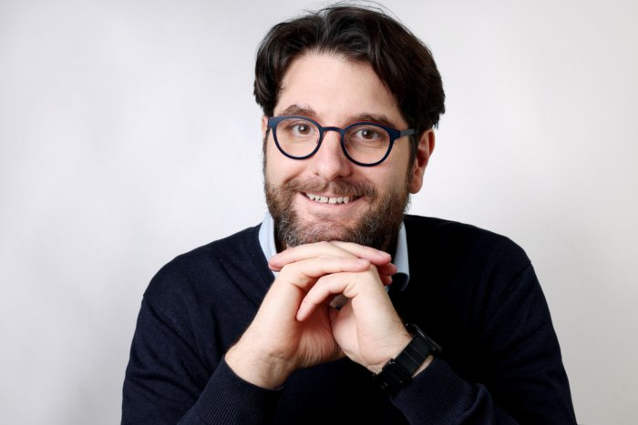

```
{{ site.data.contact.name }}
{{ site.data.contact.address }}

{{ site.data.contact.phone }}
{{ site.data.contact.email }}
{{ site.data.contact.website }}
```



# {{content.name}} 
## {{content.profession}}



{{ my_include | markdownify }}
----

## Experience


{{ my_include | markdownify }}
----

## Employments




- {{ timeline.year }}: **{{ timeline.title}}**, *{{ timeline.institute}}*   
  {{timeline.description}}



----

### Education




- {{ timeline.year }}: **{{ timeline.title}}**, *{{ timeline.institute}}*   
  {{timeline.description}}







----

### Certificates


* {{ certificate.name }}

   
   
   More info: [{{ certificate.website_url }}]({{ certificate.website_url }})

----


## Projects





### {{ project.title }}

**Time:** {{ project.year }}


**Client:** {{ project.institute}}


***{{ project.description }}***

{{ project.description_long }}


**Tasks:**

  * {{ task }}  




**Tools:**  {{ tool }}, 

----





Created: {{ "now" | date: "%Y-%m-%d" }}